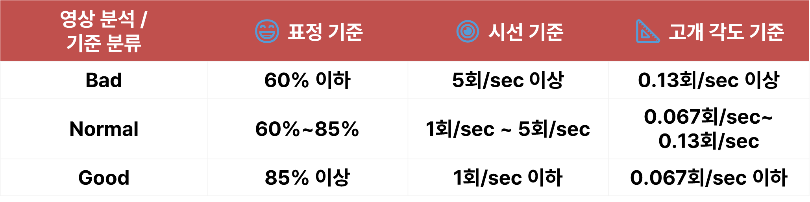
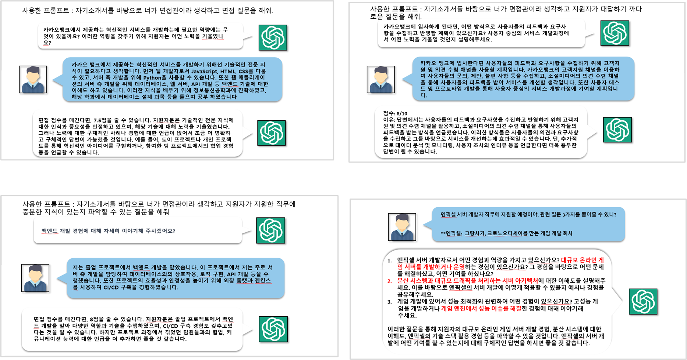
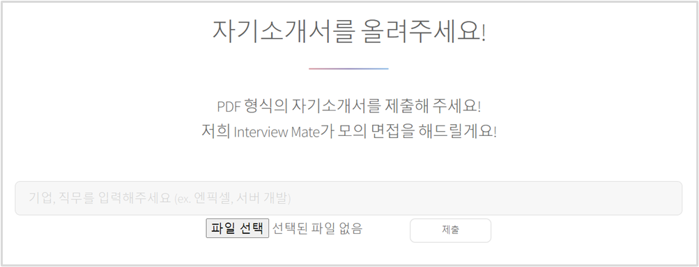
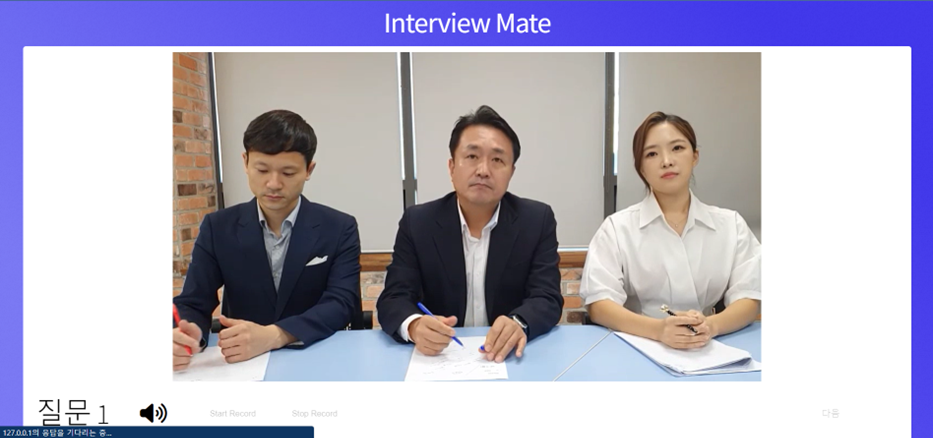
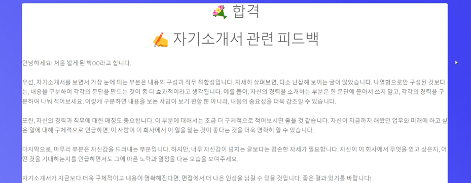
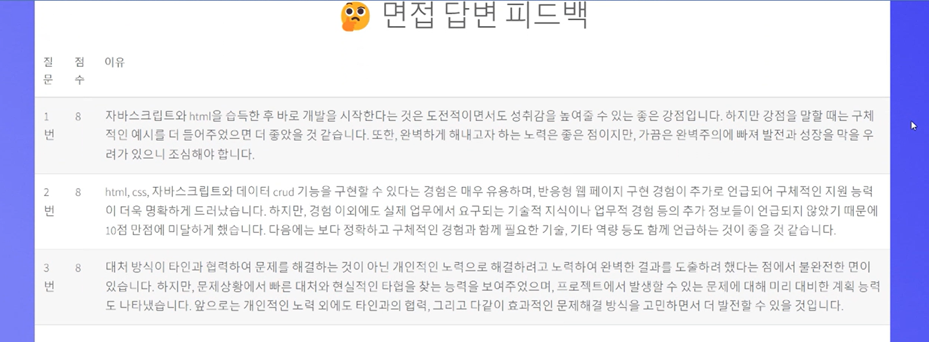
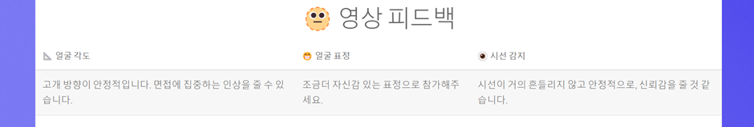

# [23-1 종합설계] 면접 서비스 ✨

## 🤔 주제 선정 이유

- 대학교나 고등학교를 졸업하고 이제 막 취업시장에 뛰어든 취업 준비생들이 자기소개서 작성과 면접 준비에 어려움을 겪는 경우가 많기 때문(비용, 혼자 준비하기 어려움 등)

- 자기소개서 작성은 인터넷 상에서 참고 할 만한 예시가 있지만, 면접 준비는 면접 예시만을 찾아 준비하는데 한계가 있고 모의 면접을 해보는 것이 중요

## 😊 기대효과

1. 면접을 준비하는데 사용되는 사교육 비용 감소
2. 예상 질문, 피드백을 통해 자기소개서 점검 가능
3. 모의 면접을 통해 실제 면접과 유사한 경험 제공

## 😎 사용자의 영상 분석

영상은 3가지(표정, 시선 방향, 고개 방향)를 분석해 피드백한다.

1. 표정

   - Haar cascade classifier를 사용하여 얼굴 감지 후 CNN 모델로 표정을 통한 감정 분류.
   - 사용자의 전체 표정 중 Neutral, Happy의 비율을 계산.

2. 시선 방향

   - Face Landmark Detection을 통해 사용자의 눈을 찾은 후 화면에서의 시선 좌표를 반환.
   - 모의면접 시작 시 사용자의 시선 좌표를 저장한 후 시선이 일정 범위를 벗어나는 횟수를 기록.

3. 고개 방향
   - Face Landmark Detection을 통해 얼굴의 랜드마크 추출. 추출된 랜드마크와 3D 모델 포인트를 사용하여 고개 방향 추정
   - 모의면접 시작 시 사용자의 고개 방향 각도를 저장한 뒤 일정 범위를 벗어나는 횟수를 기록

아래의 그림은 위의 분석에 따라 출력되는 결과 수치를 3가지 기준으로 분류한 표이다.

## ✏️ 질문 추출을 위한 프롬프트 변화 과정

첫번째 질문에서 발전된 다음 세 가지의 질문이 현재 ChatGPT가 요청받는 프롬프트이다.

질문은 자기소개서 기반 질문, 지원 직무 관련 기술 질문, 압박 면접 질문 3가지가 제공된다.

## 📄 데모 페이지

메인 페이지의 가장 아랫 부분이다.
이곳에 `지원하고자 하는 기업, 직무` + `자기소개서 PDF 파일`을 입력하면 된다.

 

ChatGPT로부터 자기소개서 피드백 및 질문 추출이 마무리 되면, 다음 인터뷰 페이지로 넘어간다. 앞서 ChatGPT를 통해 넘겨받은 질문이 음성으로 제공되고, 사용자는 아래의 버튼을 눌러 답변을 시작한다.

 

세 개의 답변에 관해 ChatGPT의 피드백이 각각 완료되면 이제 결과 페이지가 등장한다.

※ 여기서 `합격 기준` = 영상 3가지 기준 모두 Good을 충족 + 답변 3가지 10점 만점에 모두 8점 이상, 즉 24점 이상

## ▶️ 실행 방법

이 Repository를 clone한 뒤 connect.py 파일을 실행하면 된다.  
(다만 아나콘다 가상 환경 or Python Interpreter에서 영상 분석 등을 위해 필요한 패키지들을 pip install 한 뒤 실행해야 한다.)
